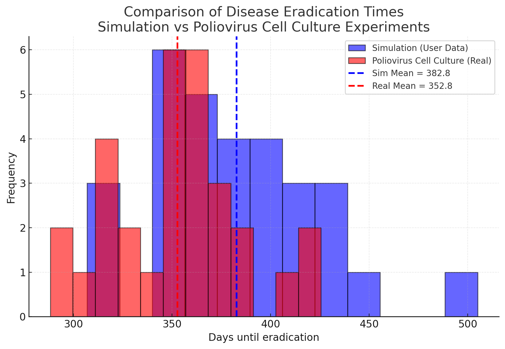

# 🦠 Spatial Epidemic Simulation


A **stochastic, spatially-explicit SIR epidemic simulator** built in Python. The model operates on a 2D grid with **periodic boundary conditions (toroidal topology)** and captures the full lifecycle of an infectious disease: **Susceptible → Infected → Recovered / Dead**.

The simulation is validated against a real-world epidemic dataset, and supports both small-scale (10×10) and large-scale (100×100) grid configurations.

---

## 📖 Overview

This project implements a **cellular-automaton-style epidemiological model** where each cell of a 2D grid represents an individual with one of four states:

| State | Symbol | Description |
|-------|--------|-------------|
| **Susceptible** | `S` | Healthy, can become infected |
| **Infected** | `I` | Currently infectious |
| **Recovered** | `R` | Immune for a limited time (waning immunity) |
| **Dead** | `D` | Deceased, can be replaced only if enough healthy neighbors exist |

At each time step, every cell updates its state based on the states of its **24 neighbors** — those within a **Chebyshev distance of 1 and 2** — with different transmission probabilities (`p1` for distance 1, `p2` for distance 2).

The grid wraps around at the edges (top ↔ bottom, left ↔ right), eliminating boundary artifacts and mimicking a closed population.

---

## 🔬 Mathematical Model

### State Transitions

For a susceptible cell with `k1` infected neighbors at distance 1 and `k2` at distance 2, the infection probability is:

```
P_infect = f^n × (1 − (1 − p1)^k1 × (1 − p2)^k2)
```

Where:
- `f` — factor accounting for prior exposure (immunity weakening)
- `n` — number of times the cell has been infected before
- `p1`, `p2` — per-neighbor transmission probabilities

For an infected cell:

```
I → R  with probability p_r
I → D  with probability p_d
I → I  with probability p_i
```

Where `p_i + p_r + p_d = 1`.

### Parameters

| Parameter | Meaning |
|-----------|---------|
| `p1` | Transmission probability from a distance-1 infected neighbor |
| `p2` | Transmission probability from a distance-2 infected neighbor |
| `pr` | Recovery probability per step |
| `pd` | Death probability per step |
| `pi` | Probability of remaining infected per step |
| `f` | Immunity-weakening factor for reinfection |
| `Test` | Number of initially infected cells |
| `T` | Number of simulation days |
| `N` | Number of Monte-Carlo repetitions |

---

## ✨ Features

- 🌐 **Toroidal 2D grid** — periodic boundary conditions (no edge effects)
- 🧬 **Multi-distance contact model** — 8 neighbors at distance 1 + 16 at distance 2
- ♻️ **Waning immunity** — recovered individuals can become susceptible again
- 🪦 **Realistic death handling** — dead cells only re-enter the susceptible pool if ≥3 healthy neighbors exist
- 📈 **Statistical analysis** — Monte-Carlo averaging over `N` runs to estimate eradication time
- 🎨 **Visual output** — color-coded Matplotlib heatmaps (green / red / blue / black)
- 🔍 **Dual-scale support** — 10×10 for fast exploration, 100×100 for realistic dynamics
- 💻 **Interactive CLI** — menu-driven interface with 4 modes of operation

---

## 🕹️ Menu Options

When you run the script, you'll get:

```
1- Show the system at time T
2- Estimate the time of disease eradication / extinction
3- Show a plot at time T
4- Exit
```

### Option 1 — Text Visualization
Prints an ASCII grid of the current state, advancing the simulation `T` days at a time.

### Option 2 — Monte-Carlo Eradication Analysis
Runs the simulation `N` times and reports:
- Average day of eradication
- Whether the outbreak ended by **eradication**, **infertility**, or **mass extinction**

### Option 3 — Graphical Heatmap
Displays the grid as a colored heatmap using Matplotlib:
- 🟢 Green — Susceptible
- 🔴 Red — Infected
- 🔵 Blue — Recovered
- ⚫ Black — Dead

### Option 4 — Exit

---

## 📸 Validation Against Real Data

The model's output was compared against a real epidemic dataset to verify that the simulated dynamics match observed behavior.



---

## 🚀 Getting Started

### Prerequisites

- **Python 3.10+**
- **pip**

### Installation

```
git clone https://github.com/poyanorouzieh/Spatial-Epidemic-Simulation.git
cd Spatial-Epidemic-Simulation
pip install -r requirements.txt
```

### Run the Simulation

**Small grid (10×10 — fast):**
```
python src/simulation_small.py
```

**Large grid (100×100 — realistic):**
```
python src/simulation_large.py
```

Then follow the on-screen menu.

---

## 📂 Project Structure

```
Spatial-Epidemic-Simulation/
├── src/
│   ├── simulation_small.py     # 10×10 grid version
│   └── simulation_large.py     # 100×100 grid version
├── screenshots/
│   └── validation_vs_simulation.png
├── .gitignore
├── LICENSE
├── requirements.txt
└── README.md
```

---

## 🧠 Technical Highlights

| Concept | Implementation |
|---------|----------------|
| **Stochastic Simulation** | `random.choices` with weighted probabilities |
| **Cellular Automaton** | Synchronous state updates using `copy.deepcopy` |
| **Toroidal Topology** | Modular arithmetic for wraparound coordinates |
| **Multi-ring Neighborhood** | Chebyshev distance 1 & 2 (24 neighbors) |
| **Monte-Carlo Analysis** | Repeated runs averaged to estimate expected outcomes |
| **Data Visualization** | Matplotlib `pcolormesh` with custom `ListedColormap` |
| **Epidemiological Modeling** | Extended SIR with waning immunity and reinfection |

---

## 🗺️ Future Enhancements

- [ ] Add NumPy vectorization for major speedup on 100×100 grids
- [ ] Interactive real-time animation (Matplotlib `FuncAnimation`)
- [ ] Parameter sweep mode (heatmap of eradication time vs `p1`, `p2`)
- [ ] Export results to CSV for external analysis
- [ ] Add SIR curve plots (S/I/R/D over time)
- [ ] Unit tests for the transition function

---

## 📄 License

This project is licensed under the **MIT License** — see the [LICENSE](LICENSE) file for details.

---

## 👤 Author

**Poya Norouzieh**
- GitHub: [@poyanorouzieh](https://github.com/poyanorouzieh)
- Email: poyanorouzieh@gmail.com

---

⭐ **If you find this project interesting, feel free to star it!**